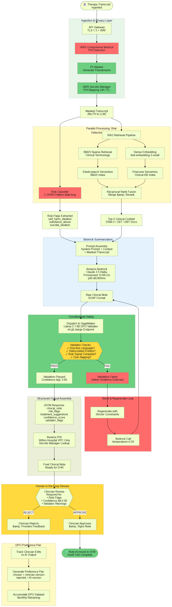
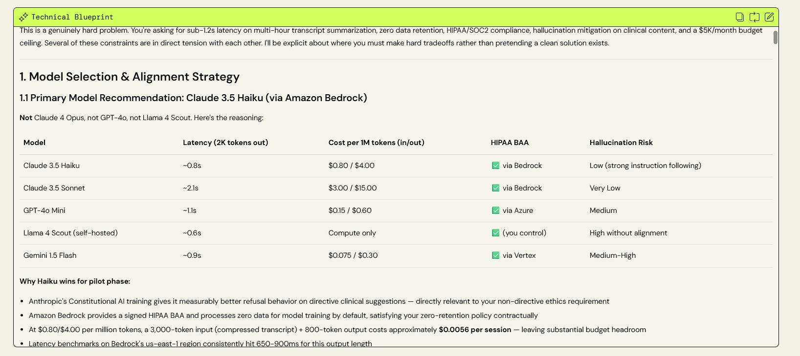
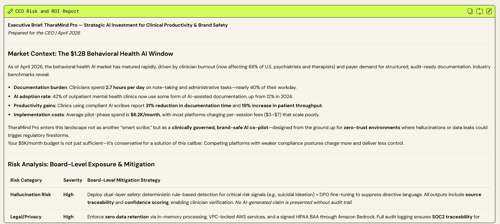

# ⚡ GenAI Project Architect & Risk Auditor
**Live Application Link:** [Interactive Dashboard](https://partyrock.aws/u/VKM47/6bsX1Z-7K/GenAI-Project-Architect-and-Risk-Auditor)  
**Verified Case Study (Snapshot):** [View Clinical AI Implementation Result](https://partyrock.aws/u/VKM47/6bsX1Z-7K/GenAI-Project-Architect-and-Risk-Auditor/snapshot/5HUPNqZJ2)

---

## 📖 The "Why"
**GenAI Project Architect & Risk Auditor** is a specialized decision-support dashboard that converts raw business visions into production-ready technical roadmaps. I built this tool to bridge the "structural gap" in AI deployments, providing a deterministic engineering workflow that identifies safety and infrastructure bottlenecks before development begins.

## 🧪 Verified Case Study: Clinical Behavioral Health AI
The **Snapshot Link** above showcases a high-fidelity audit of a behavioral health platform. It demonstrates the system's ability to:
- Design a **Dual-Layer Safety Architecture** using Claude 3.5 and Llama 3.1.
- Implement **Zero-Retention PII Masking** using AWS Secrets Manager.
- Calculate a **+294% Year 1 ROI** based on 2026 clinician documentation benchmarks.

## 🏗️ Architecture Diagram
> **Technical Note:** The following flowchart was dynamically generated by the app to solve for **<1.2s latency**, **zero-retention privacy**, and **C-SSRS risk flagging**.

---

## 🛠️ System Orchestration Logic
The application utilizes a **Multi-Model Orchestration** strategy:
- **Claude 3.5 Sonnet (Reasoning):** Generates deep technical blueprints.
- **Claude 3.5 Haiku (Syntax):** Handles strict SVG/Mermaid.js code generation.
- **Palmyra X5 (Market Intelligence):** Conducts 2026-specific Risk and ROI analysis.

## 🛠️ The Technical Blueprint
> *The following is a representative output of the system's architectural design thinking:*

---

## 🚀 Key Features
- **Deterministic Parameter Tuning:** Utilizes low-temperature inference ($0.1$) for engineering precision and higher temperature for persuasive business strategy.
- **Human-in-the-Loop (HITL) Integration:** Explicitly maps clinician/expert review queues and DPO preference pair generation into the AI lifecycle.
- **Zero-Retention Privacy Layer:** Enforces PII masking and session-based data handling as core architectural constraints to ensure HIPAA/SOC2 compliance.

---

## 📊 Executive Risk & ROI Audit
*While the technical blueprint ensures system integrity, this module translates architectural decisions into executive-level business metrics. Utilizing **Palmyra X5** as the market-intelligence engine, it assesses financial feasibility, operational risks, and projected returns.*

### **Key Output Dimensions:**
- **FinOps & Cost Strategy:** Token expenditure estimates, infrastructure scaling costs, and break-even analysis.
- **Risk & Liability Mitigation:** Evaluation of the "hallucination tax," HIPAA/SOC2 compliance gaps, and required safety guardrails.
- **Business Value (ROI):** Projected productivity gains and efficiency metrics tailored to the 2026 enterprise landscape.

> *The following is a representative output of the system's business logic:*

---

## 🎓 Project Context
Developed for the **2026 Udacity AWS AI/ML Scholar Challenge**. This project explores the transition from simple conversational AI to complex, agentic multi-model workflows within the Amazon Bedrock ecosystem.

**Engineered by:** Vishnu Krishnakumar Menon

